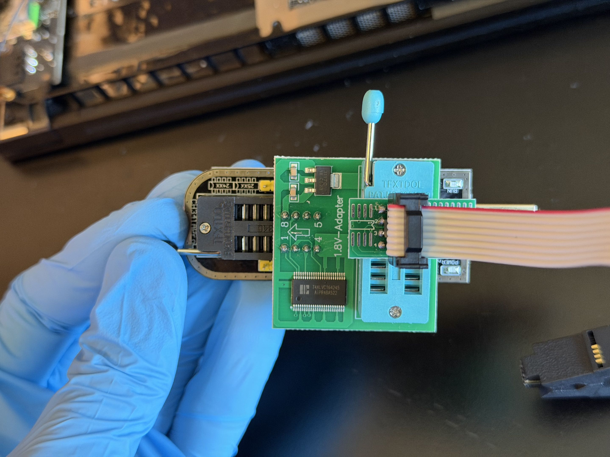
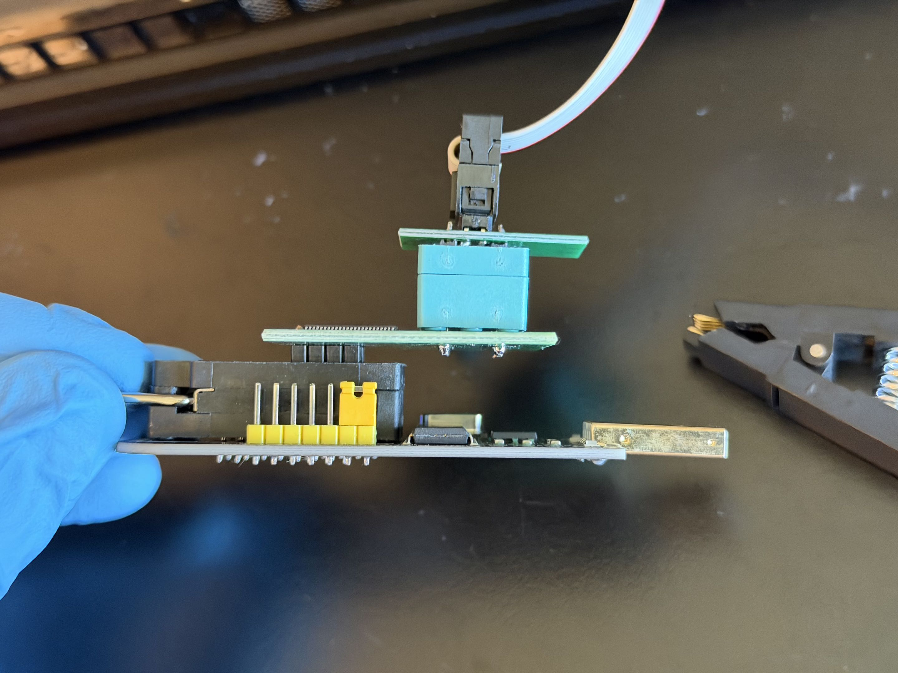
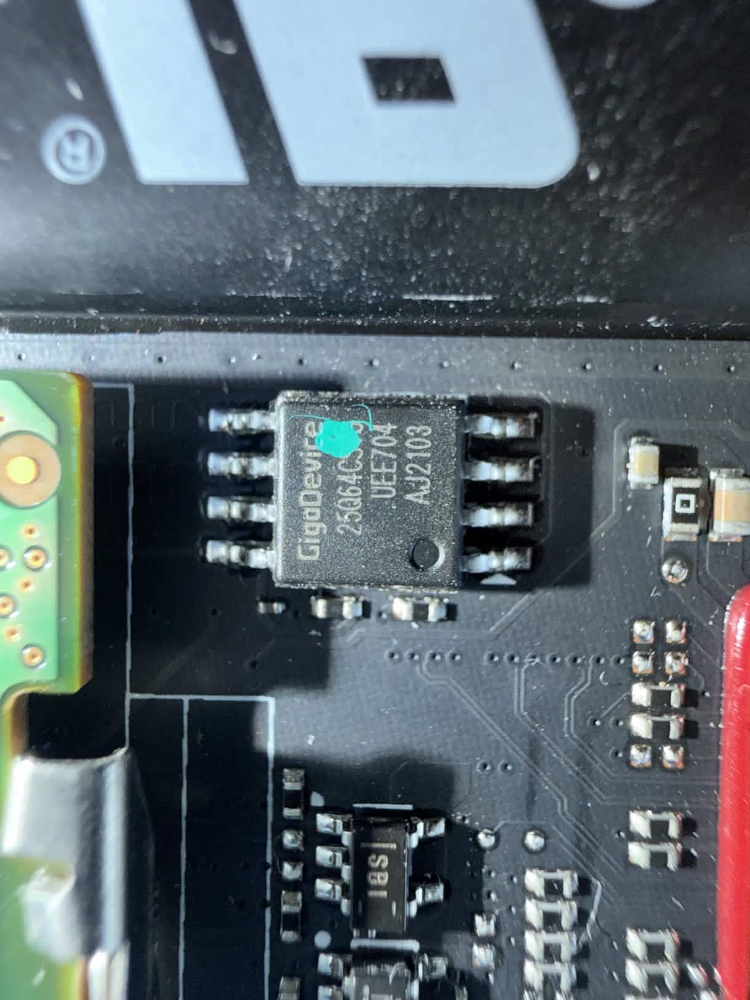
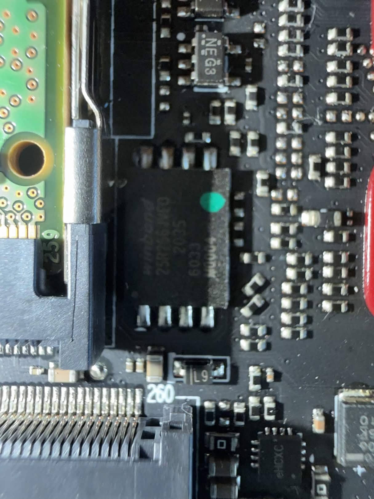
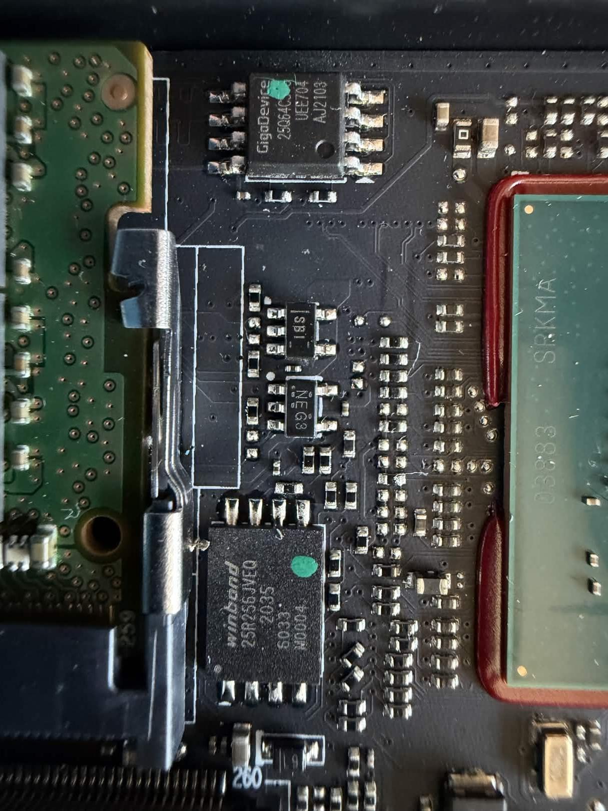
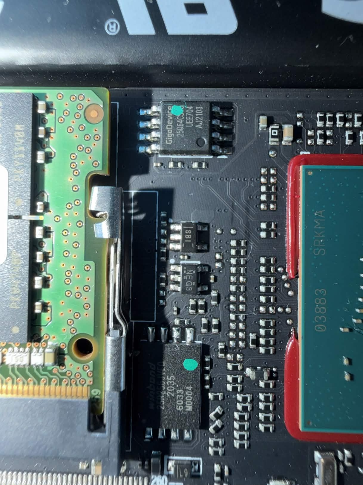
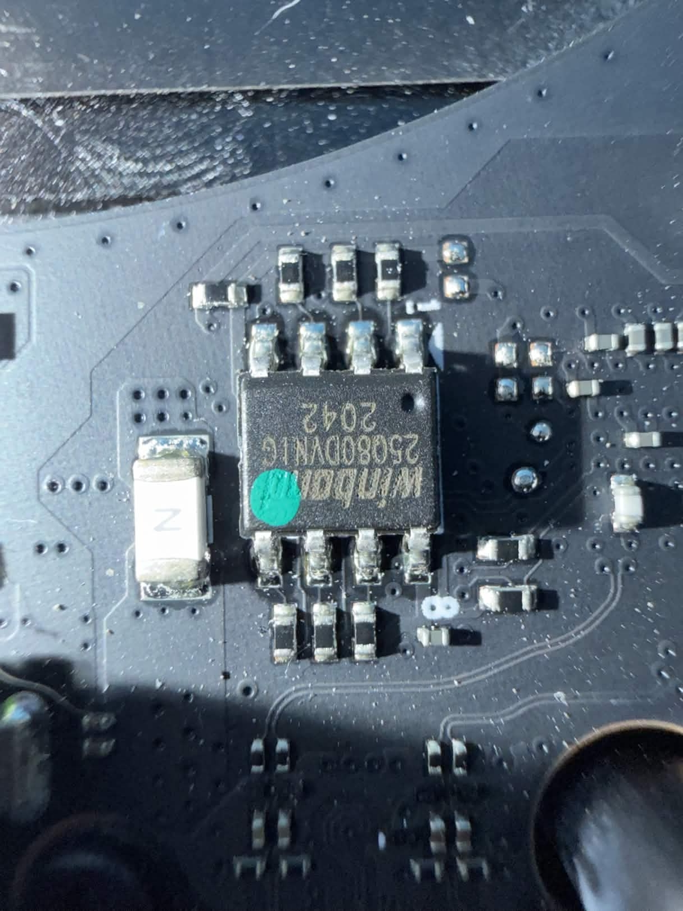
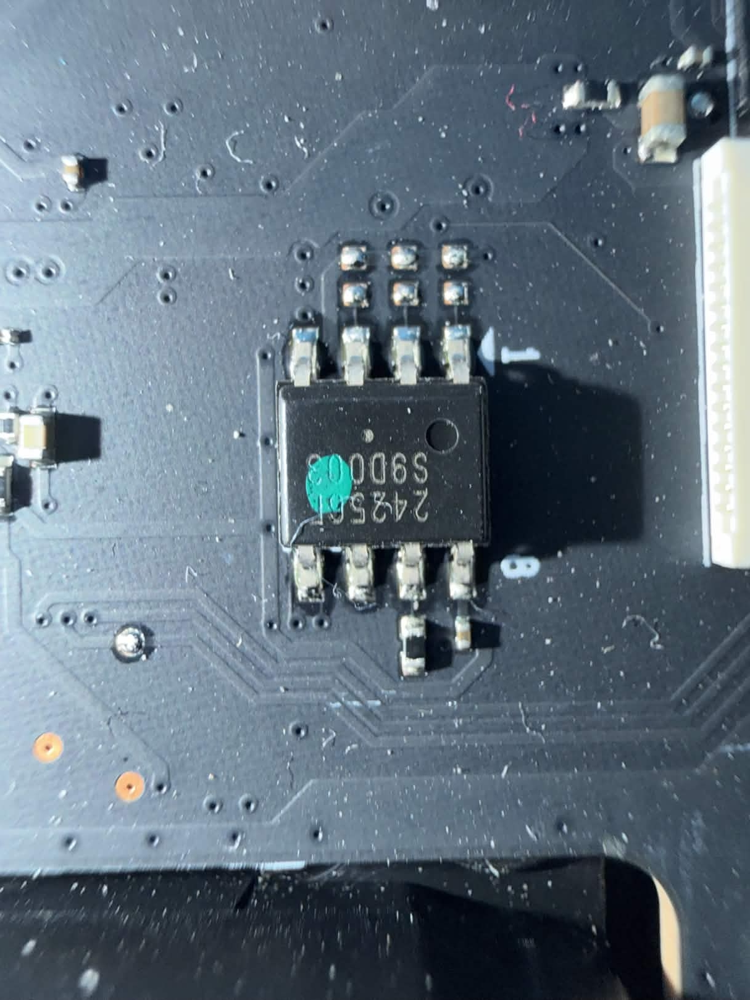

# Razer Blade 15 Advanced 2021 (RZ09-0409) — GPU VBIOS Flash Chip Location & CH341A Setup

Hardware reference photos for NVIDIA RTX 3080 Laptop GPU (GA104M) VBIOS recovery on the Razer Blade 15 Advanced (Early 2021). Taken during a corrupted VBIOS recovery using a CH341A SPI programmer. All EXIF metadata stripped.

**Laptop:** Razer Blade 15 Advanced (Early 2021), RZ09-0409CEC3
**GPU:** NVIDIA GA104M RTX 3080 Laptop 8GB
**VBIOS flash chip:** Winbond W25Q16JWN (1.8V SOP8, 16Mbit/2MB)

---

## GPU VBIOS Flash Chip — Winbond W25Q16JWN

The target SPI flash chip for VBIOS recovery. SOP8 package, 1.8V (1.65V-1.95V). Markings: "winbond", "25Q16JWN", date code "2105", blue dot on pin 1. JEDEC ID: 0xEF6015.

---

## Full Motherboard Overview

Complete motherboard with backplate removed. The GPU VBIOS flash chip (W25Q16JWN) is between the GPU die and RAM modules.

---

## CH341A USB SPI Programmer with 1.8V Adapter

The programmer setup for in-circuit SPI flashing. The 1.8V adapter uses an AMS1117-1.8 regulator to drop VCC but passes data lines (MOSI/CLK/CS) at 3.3V — this causes partial write failures on 1.8V chips. Needs a TXS0108E level shifter or CH347T for proper 1.8V data line driving.

---

## GPU Area — Flash Chip Location Context

Where the W25Q16JWN lives. Located near the GPU die between VRAM and heatsink mounts.

---

## Other SOP8 Chips — Don't Flash These

Multiple SOP8 flash chips on the board. Only the W25Q16JWN is the GPU VBIOS. Flashing the wrong one bricks the laptop.

### GigaDevice GD25B64C (8MB) — System BIOS

### GigaDevice + Winbond Side by Side

### Winbond W25Q80DVN1G (1MB) — Not the GPU VBIOS Chip

Different part number, different size. Don't flash this one.

### Unknown — "2425SL"

---

## General Teardown Photos

General Razer Blade 15 2021 teardown reference photos not specific to VBIOS recovery are in [`teardown/`](teardown/).
